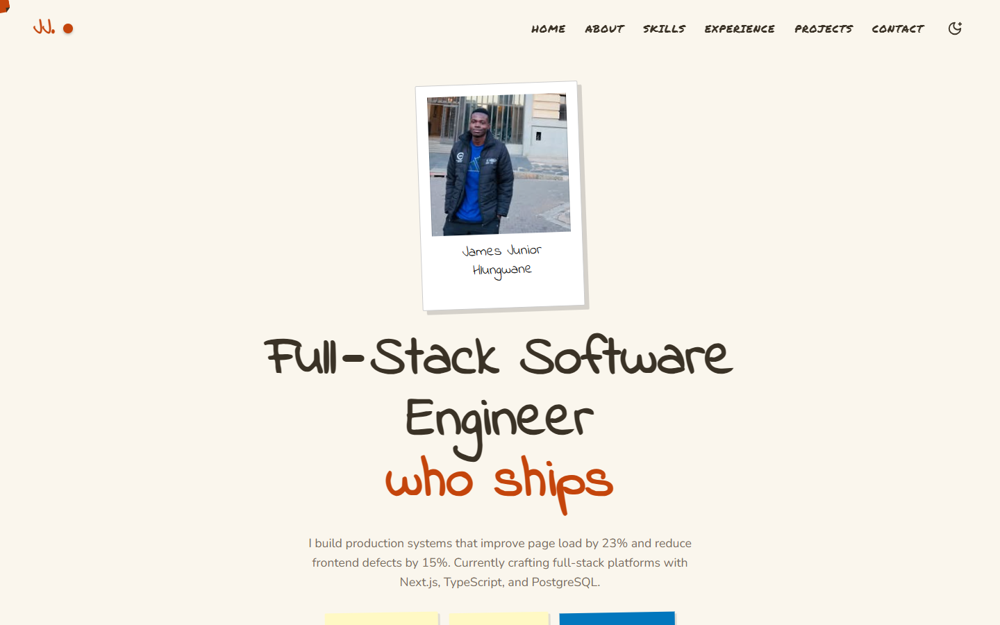

<div align="center">

# James Junior Hlungwane · Portfolio

**A hand-drawn "sketchbook" portfolio with a paper and a chalkboard theme, built with React 19, TypeScript and Framer Motion.**

[**Visit the site**](https://react-portfolio-black-sigma.vercel.app) · [Download my CV](https://react-portfolio-black-sigma.vercel.app/James-Junior-Hlungwane-CV.pdf) · [GitHub](https://github.com/De-Junior)



</div>

## Featured work

| Project | What it shows | Links |
|---|---|---|
| **TeamFlow** | Multi-tenant SaaS: tenant isolation, role-based access, Kanban, Stripe billing, realtime notifications, tests and CI | [Live demo](https://teamflow-rosy-three.vercel.app) · [Code](https://github.com/De-Junior/Teamflow) |
| **ConnectDevs** | Developer collaboration platform: Server Actions, applications workflow, messaging, notifications | [Live](https://connect-liart-omega.vercel.app) · [Code](https://github.com/De-Junior/Connect) |
| **Healthcare Dashboard** | Vanilla JS dashboard with Chart.js visualisations of patient data | [Live](https://de-junior.github.io/Health-Care/) · [Code](https://github.com/De-Junior/Health-Care) |

## About this site

- **Two themes, one source of truth.** Colours, fonts and component styles are CSS variables generated per theme in [`src/theme/globalCss.ts`](src/theme/globalCss.ts); the toggle swaps them at runtime and remembers the choice.
- **Content as data.** Projects, experience and skills live in [`src/data/`](src/data), so updating the CV never means editing layout code.
- **Resilient sections.** Each section has its own error boundary, so if the live GitHub stats can't load, the rest of the page still renders.
- **Accessible and shareable.** Skip link, labelled landmarks, `prefers-reduced-motion` support, and static Open Graph tags so links preview properly on LinkedIn and WhatsApp.
- **Working contact form** via Formspree.

## Structure

```
src/
├── App.tsx            page composition
├── sections/          Hero, About, Skills, Experience, Projects, Contact…
├── components/        Navbar, Footer, TiltCard, cursor, scroll progress, error boundary
├── data/              projects, experience and skills content
├── theme/             theme provider, hook and generated global CSS
├── config.ts          GitHub username and Formspree form ID
└── types.ts
public/                CV, photo, favicon and social preview image
```

## Running locally

```bash
npm install
npm run dev        # http://localhost:5173
npm run build      # typecheck and production build
npm run lint
```

Optionally set `VITE_FORMSPREE_ID` in `.env` to send the contact form to your own Formspree inbox.

## Tech

React 19 · TypeScript · Vite · Framer Motion · Formspree · Tailwind CSS (base reset) · Vercel
