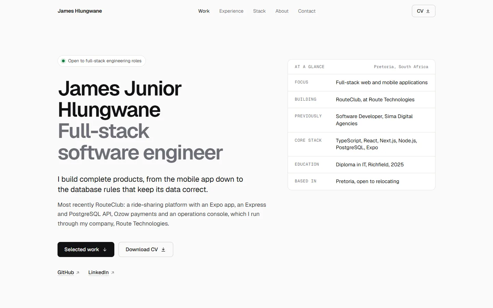

# James Junior Hlungwane · Portfolio

Source for [react-portfolio-black-sigma.vercel.app](https://react-portfolio-black-sigma.vercel.app): case studies of RouteClub, TeamFlow and ConnectDevs, with experience, stack and contact details.



## Approach

- **Content is data.** Everything a recruiter reads lives in `src/content/` (profile, projects, career). Updating the CV means editing typed objects, not layout.
- **Case studies over cards.** Each project opens with the same header (positioning and facts) and then gets its own composition: phone screens and an architecture diagram for RouteClub, layered browser views for TeamFlow, a denser dark panel for ConnectDevs.
- **Restraint in the frame.** The palette is near-monochrome so colour comes from the projects. Both light and dark follow the system setting.
- **No runtime dependencies beyond React.** Motion is CSS plus one `IntersectionObserver`, icons are eight inline paths, and the contact form posts to Formspree with `fetch`. The production bundle is about 74 KB of JavaScript gzipped, most of which is React.

## Structure

```
src/
├── App.tsx              page composition
├── content/             profile, projects and career data
├── sections/            Hero, Work (one file per case study), Approach, Experience, Stack, About, Contact
├── components/          small shared pieces: links, frames, fact and decision lists, the RouteClub diagram
├── hooks/               scroll reveal and active-section tracking
└── styles.css           design tokens (Tailwind v4 @theme), base styles, reveal motion
public/
├── work/                project screenshots (WebP, sized to avoid layout shift)
└── og-image.png         link preview image
```

## Accessibility and performance

- One `h1`, ordered headings, landmark labels, and a skip link.
- Visible focus rings, an Escape-closable mobile menu that returns focus, and touch targets of at least 24 px.
- `prefers-reduced-motion` disables reveals and smooth scrolling.
- Geist is self-hosted through Fontsource, so there is no third-party font request; only the Latin subset loads.
- Every image has explicit dimensions and loads lazily below the fold.

## Running locally

```bash
npm install
npm run dev        # http://localhost:5173
npm run build      # typecheck and production build
npm run lint
```

Set `VITE_FORMSPREE_ID` in `.env` to send the contact form to a different Formspree inbox.

## Tech

React 19, TypeScript, Vite, Tailwind CSS 4, Fontsource (Geist), Vercel.
